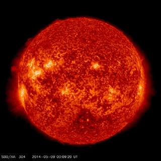

# SDO-Vid

Quick and dirty node script that downloads and concatenates SDO videos.



SDO: The Solar Dynamics Observatory is the first mission to be launched for NASA's Living With a Star (LWS) Program, a program designed to understand the causes of solar variability and its impacts on Earth. SDO is designed to help us understand the Sun's influence on Earth and Near-Earth space by studying the solar atmosphere on small scales of space and time and in many wavelengths simultaneously.

SDO's goal is to understand, driving towards a predictive capability, the solar variations that influence life on Earth and humanity's technological systems by determining

- how the Sun's magnetic field is generated and structured
- how this stored magnetic energy is converted and released into the heliosphere and geospace in the form of solar wind, energetic particles, and variations in the solar irradiance.

(quoted from: https://sdo.gsfc.nasa.gov/mission/)

### Requirements

- ffmpeg

### Setup

- install [ffmpeg](https://www.ffmpeg.org/download.html)
- clone this repo
- run `npm install`

### Usage

```
Usage: ./sdovid [options] <directory>

Options:

  -V, --version                     output the version number
  -d, --dates <dateFrom>..<dateTo>  Date range of SDO data to download (default: 2014-05-09,2014-05-10)
  -i, --instruments <instruments>   A comma separated list of SDO instruments (default: 0094,0131,0171,0193,0211,0304,0335,1600,1700,4500,HMIB,HMID,HMII)
  -h, --help                        output usage information
```
